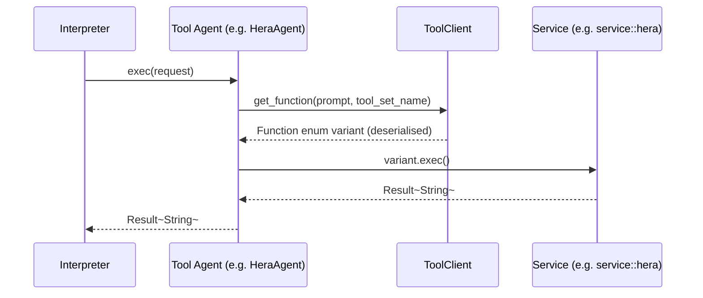

# Agent Module

The `agent` module contains the domain agent structs. Each agent receives a `SlmRequest` and returns either a `Result<String>` (for data-retrieval agents) or a `Result<StringStream>` (for LLM-presentation agents). Agents are instantiated per-request inside `Interpreter::eval`.

Agents divide into three groups:

| Group | Agents | Return type |
|---|---|---|
| **Tool agents** — use `ToolClient` for function selection | `HealthAgent`, `WeatherAgent`, `HeraAgent` | `Result<String>` |
| **Context agents** — use regex/service lookups directly | `TimeServiceAgent`, `UserProfileAgent`, `MeasurementUnitAgent` | `Result<String>` |
| **Presentation agents** — forward to the local LLM | `PrinterAgent`, `QueryAgent` | `Result<StringStream>` |

## Class Diagram

```mermaid
classDiagram

    %% ── Tool Agents ────────────────────────────────────────────────────────────

    class HealthAgent {
        -tool_client : &ToolClient
        +new(tool_client: &ToolClient)$ HealthAgent
        +exec(request: &SlmRequest) Result~String~
    }

    class WeatherAgent {
        -tool_client : &ToolClient
        +new(tool_client: &ToolClient)$ WeatherAgent
        +exec(request: &SlmRequest) Result~String~
    }

    class HeraAgent {
        -tool_client : &ToolClient
        +new(tool_client: &ToolClient)$ HeraAgent
        +exec(request: &SlmRequest) Result~String~
    }

    %% ── Context Agents ─────────────────────────────────────────────────────────

    class TimeServiceAgent {
        +new()$ TimeServiceAgent
        +exec(request: &SlmRequest) Result~String~
    }

    class UserProfileAgent {
        +new()$ UserProfileAgent
        +exec(request: &SlmRequest) Result~String~
    }

    class MeasurementUnitAgent {
        +new()$ MeasurementUnitAgent
        +exec(request: &SlmRequest) Result~String~
    }

    %% ── Presentation Agents ────────────────────────────────────────────────────

    class PrinterAgent {
        -http_client : reqwest::Client
        -model_url   : &str
        +new()$ PrinterAgent
        +exec(request: SlmRequest) Result~StringStream~
    }

    class QueryAgent {
        -http_client : reqwest::Client
        -model_url   : &str
        +new()$ QueryAgent
        +exec(request: SlmRequest) Result~StringStream~
    }
```

## Tool Agents

Tool agents delegate function selection to `ToolClient::get_function`, which calls the SLM with a named tool-set and deserialises the response into a tagged enum. The enum variant is then executed against the corresponding service.

### Execution Pattern

### Function Enumerations

Each tool agent has a private `Function` enum tagged on `"function"`. The variants map directly to the service call structs:

**HealthAgent functions:** `save_blood_measurement`, `save_temperature`, `save_weight`, `save_glucose`, `read_medical_records`

**WeatherAgent functions:** `get_current_weather`, `get_forecast`, `get_today_forecast`

**HeraAgent functions:** `list_devices`, `describe_device`, `get_device_actions`, `read_temperature`, `read_humidity`, `read_sensors`, `start_heating`, `stop_heating`, `get_heating_state`, `run_diagnose`, `run_device_diagnose`, `run_system_diagnose`

## Context Agents

Context agents do not call the SLM. They apply deterministic logic (regex matching, database lookups) to answer well-defined factual questions quickly.

| Agent | Service | Typical prompt |
|---|---|---|
| `TimeServiceAgent` | `service::time` | `"Get the date for today."` |
| `UserProfileAgent` | `service::user` | `"Get the username for Rotaru Iulian."` |
| `MeasurementUnitAgent` | `service::measure_unit` | `"Get the measure units for distance."` |

## Presentation Agents

Presentation agents receive the accumulated `FactsStack` context as the system prompt and send the original user prompt to the local LLM, producing a human-readable streaming response.

| Agent | System instruction |
|---|---|
| `PrinterAgent` | *"Print a human readable response based on user prompt and provided context data."* |
| `QueryAgent` | *"Execute the following query using the data in context. Generate response in a human readable format."* |

Both agents construct an `LlmRequest` from the `SlmRequest`'s system and prompt fields, POST it to `http://jarvis.local/v1/chat/completions`, and return the response as a `StringStream`.
