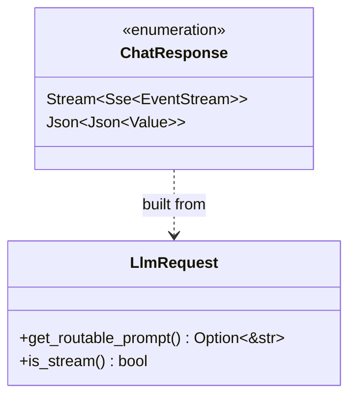
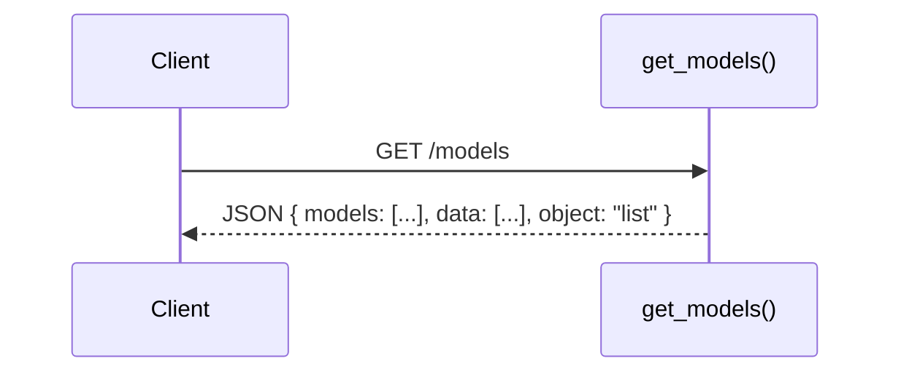
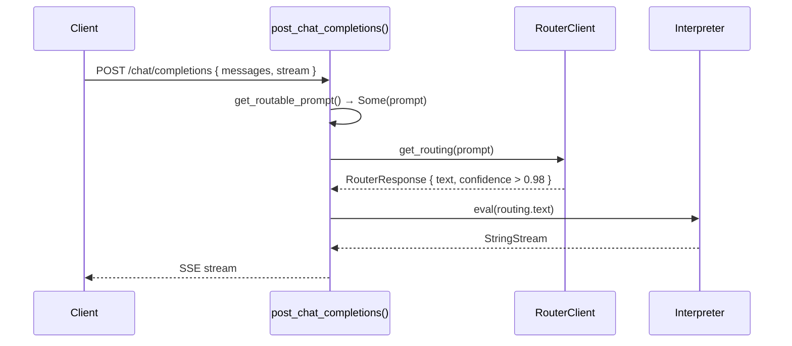
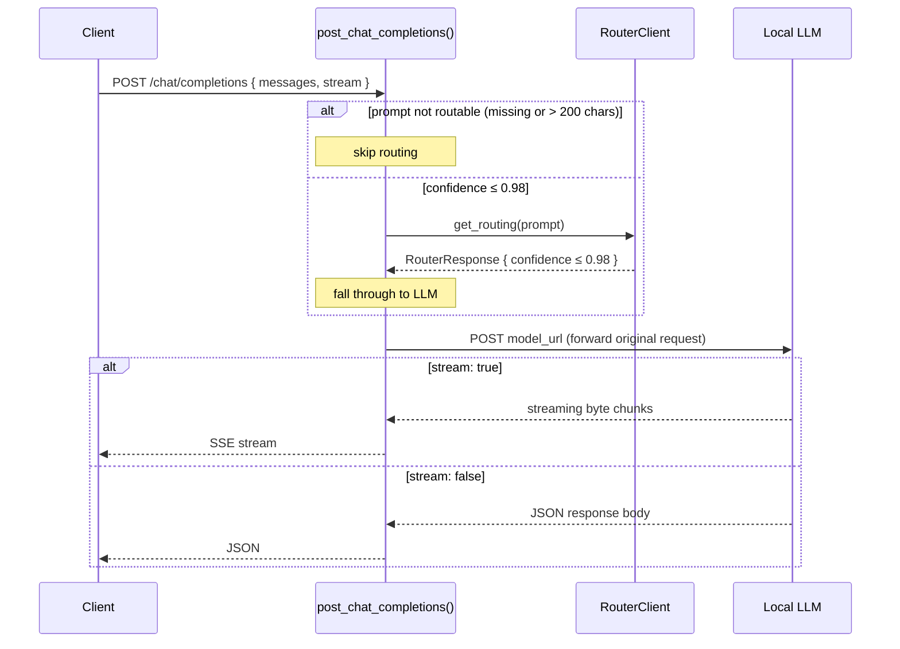

# API Module

The `api` module is the HTTP server layer. It creates an Axum router and exposes two endpoints that emulate the OpenAI chat API, allowing any OpenAI-compatible client to talk to Jarvis.

## Endpoints

| Method | Path | Handler |
|---|---|---|
| `GET` | `/models` | Returns a static list of available models |
| `POST` | `/chat/completions` | Accepts a chat request, routes it, and returns a response |

## Key Characteristics

| Property | Value |
|---|---|
| Framework | Axum |
| Response format | SSE stream (when `stream: true`) or JSON |
| Routing threshold | Confidence > 0.98 — requests below this are forwarded to the LLM |
| Routing condition | Only prompts ≤ 200 characters are eligible for routing |

## Class Diagram

## Sequence Diagrams

### GET /models

### POST /chat/completions — Routed Request

When the last user message is short enough and the router returns high confidence, the request is handled entirely by the `Interpreter` without touching the downstream LLM.

### POST /chat/completions — LLM Fallback

When the prompt is not routable (too long, no user message, or low router confidence), the request is proxied directly to the local LLM.

## ChatResponse

An internal enum that unifies the two possible response shapes. Axum's `IntoResponse` is implemented so that both variants serialise correctly to the HTTP response.

| Variant | Produced from | HTTP response |
|---|---|---|
| `Stream(Sse<EventStream>)` | `StringStream` or `ByteStream` | `text/event-stream` |
| `Json(Json<Value>)` | `serde_json::Value` | `application/json` |
