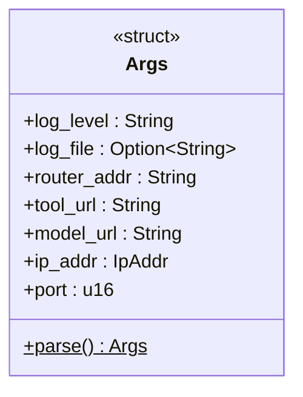

# Args Module

The `args` module parses command-line arguments at startup using the `clap` crate. All values are collected in a single `Args` struct that `main` reads once and passes to the relevant subsystems.

## Parameters

| Argument | Short | Default | Description |
|---|---|---|---|
| `--log-level` | `-l` | `off` | Logging verbosity: `off`, `error`, `warn`, `info`, `debug`, `trace` |
| `--log-file` | `-f` | *(console)* | Log file path; if absent, logs go to stdout |
| `--router-addr` | `-r` | `192.168.0.5:1965` | LLM router server address (`host:port`) |
| `--tool-url` | `-t` | `http://jarvis.local:1967/` | URL of the tool-calling SLM endpoint |
| `--model-url` | `-m` | `http://jarvis.local/v1/chat/completions` | URL of the local LLM `/v1/chat/completions` endpoint |
| `--ip-addr` | `-i` | `0.0.0.0` | IP address for the HTTP server to bind |
| `--port` | `-p` | `3000` | TCP port for the HTTP server |

## Class Diagram

