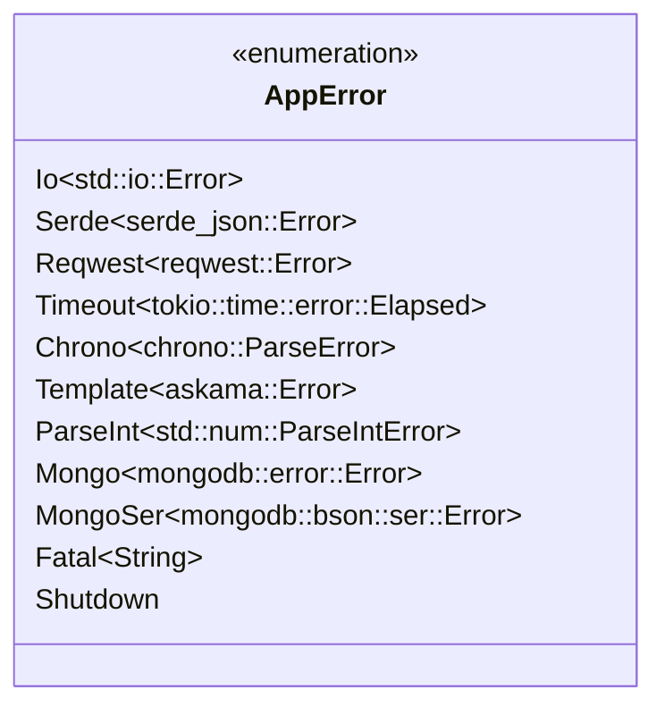

# Error Module

The `error` module defines `AppError`, the single error type used throughout the application. It is built with the `thiserror` crate, which auto-implements `std::error::Error` and `Display` for each variant.

`AppError` also implements `axum::response::IntoResponse`, so handler functions can return `Result<_, AppError>` directly and the framework converts any unhandled error into an HTTP 500 response with the error message as the body.

## Variants

| Variant | Source Type | Description |
|---|---|---|
| `Io` | `std::io::Error` | I/O failures |
| `Serde` | `serde_json::Error` | JSON (de)serialisation failures |
| `Reqwest` | `reqwest::Error` | HTTP client errors |
| `Timeout` | `tokio::time::error::Elapsed` | Async timeout exceeded |
| `Chrono` | `chrono::ParseError` | Date/time parsing |
| `Template` | `askama::Error` | Template rendering |
| `ParseInt` | `std::num::ParseIntError` | Integer parsing |
| `Mongo` | `mongodb::error::Error` | MongoDB driver errors |
| `MongoSer` | `mongodb::bson::ser::Error` | BSON serialisation errors |
| `Fatal(String)` | *(manual)* | Unrecoverable runtime error with a descriptive message |
| `Shutdown` | *(manual)* | Signals an intentional shutdown; used internally by the router background task |

All variants except `Shutdown` and `Fatal` are constructed via the `#[from]` attribute, enabling transparent use of the `?` operator throughout the codebase.

## Class Diagram

