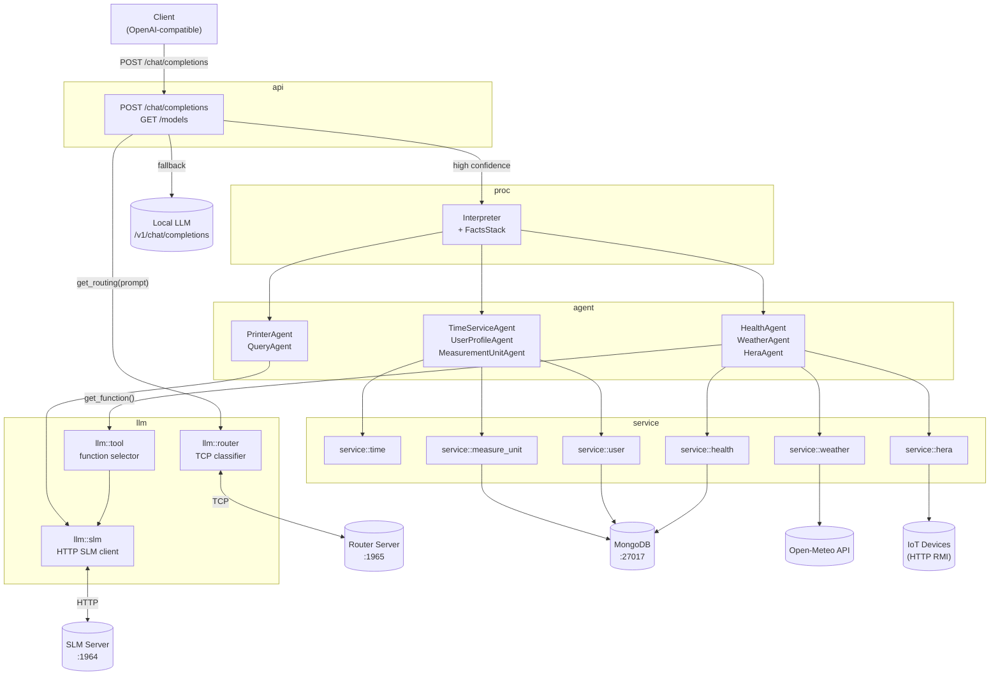

# Jarvis — Module Reference

Jarvis is a local AI assistant server. It exposes an OpenAI-compatible HTTP API, classifies incoming prompts with a lightweight router, and dispatches them to specialised domain agents. Agents collect facts from services, accumulate them into a reasoning context, and present the final answer via the local LLM.

## Architecture Overview

## Module Index

### Infrastructure

| Module | Document | Description |
|---|---|---|
| `args` | [args.md](args.md) | CLI argument parsing |
| `error` | [error.md](error.md) | `AppError` — unified error type |
| `logger` | [logger.md](logger.md) | Logging initialisation |
| `types` | [types.md](types.md) | `AppState`, stream type aliases |
| `util` | [util.md](util.md) | String helper functions |

### LLM Clients (`llm`)

| Module | Document | Description |
|---|---|---|
| `llm::router` | [router.md](router.md) | Prompt classifier over a persistent TCP connection |
| `llm::slm` | [llm-slm.md](llm-slm.md) | HTTP client for the Small Language Model |
| `llm::tool` | [llm-tool.md](llm-tool.md) | Function selection via the SLM |
| `llm::types` | [llm-types.md](llm-types.md) | OpenAI-compatible request/response types |

### HTTP API (`api`)

| Module | Document | Description |
|---|---|---|
| `api` | [api.md](api.md) | Axum router — `GET /models`, `POST /chat/completions` |

### Execution Engine (`proc`)

| Module | Document | Description |
|---|---|---|
| `proc` | [proc.md](proc.md) | `Interpreter` + `FactsStack` — multi-step action execution |

### Agents (`agent`)

| Module | Document | Description |
|---|---|---|
| `agent` | [agent.md](agent.md) | All domain agents: health, weather, hera, time, user, measure-units, printer, query |

### Services (`service`)

| Module | Document | Description |
|---|---|---|
| `service::health` | [service-health.md](service-health.md) | MongoDB — personal health measurements |
| `service::hera` | [service-hera.md](service-hera.md) | Home automation — IoT device control and diagnostics |
| `service::weather` | [service-weather.md](service-weather.md) | Open-Meteo weather API |
| `service::time` | [service-time.md](service-time.md) | Deterministic date arithmetic |
| `service::user` | [service-user.md](service-user.md) | MongoDB — user profile properties |
| `service::measure_unit` | [service-measure-unit.md](service-measure-unit.md) | MongoDB — measurement unit lookup |
