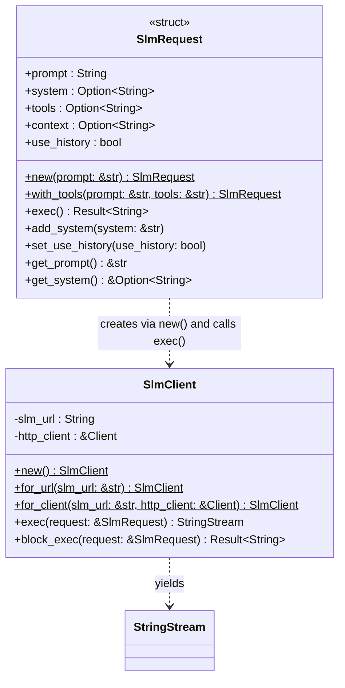
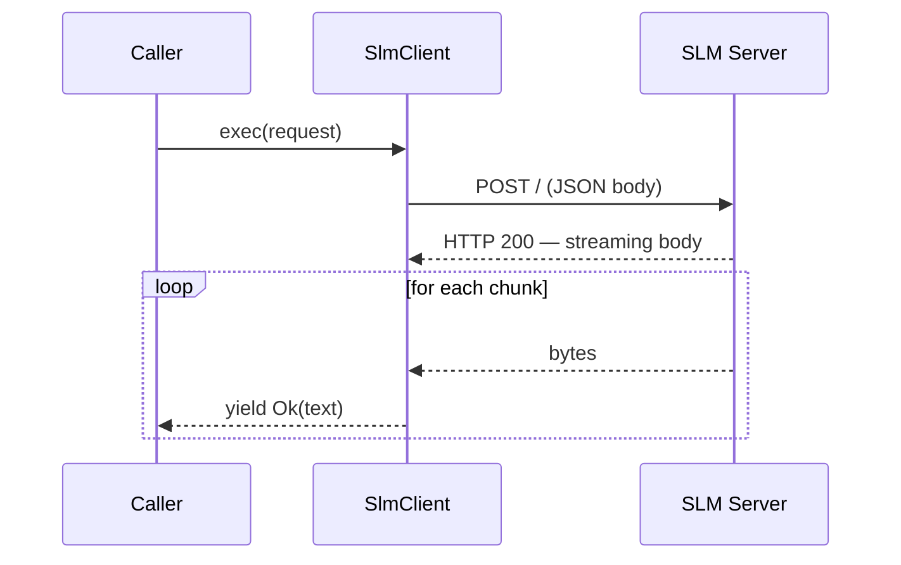
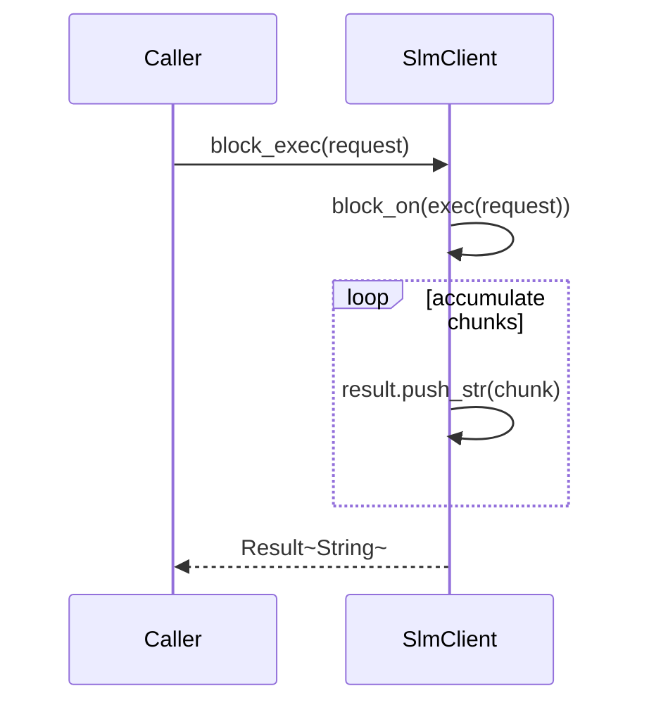

# LLM — SLM Client Module

The `llm::slm` module provides a lightweight HTTP client for the **Small Language Model (SLM)** service — a local, low-latency model used for tool selection, function-call generation, and quick contextual responses. The SLM server streams its response as plain text chunks over HTTP.

## Key Characteristics

| Property | Value |
|---|---|
| Transport | HTTP POST, streaming response body |
| Default URL | `http://jarvis.local:1964/` |
| Request format | JSON body (`SlmRequest`) |
| Response format | Plain text stream (UTF-8 chunks) |
| Blocking variant | `block_exec` collects the full stream synchronously |

## Class Diagram



## Sequence Diagrams

### Async Streaming Request

`exec()` returns a `StringStream` immediately. The caller drives the stream by polling it.



### Blocking Request

`block_exec` drives the async `exec` to completion via `futures::executor::block_on`, accumulating all chunks into a single `String`.



## HTTP Client Strategy

A `lazy_static` global `reqwest::Client` is used when `SlmClient::new()` or `for_url()` is called. `for_client()` accepts a borrowed client, allowing the caller to supply a shared instance (used by `ToolClient`).

## Request Payload

```json
{
    "prompt": "What is the temperature in the kitchen?",
    "system": "You are a helpful assistant.",
    "tools": "hera",
    "context": null,
    "use_history": false
}
```

All fields except `prompt` are optional. `tools` names the tool-set that the SLM should consider when generating a function call. `use_history` controls whether the SLM uses its conversation history.
