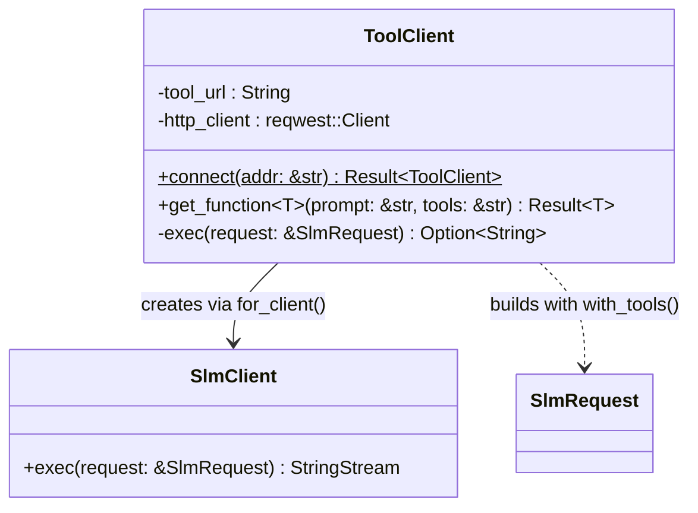
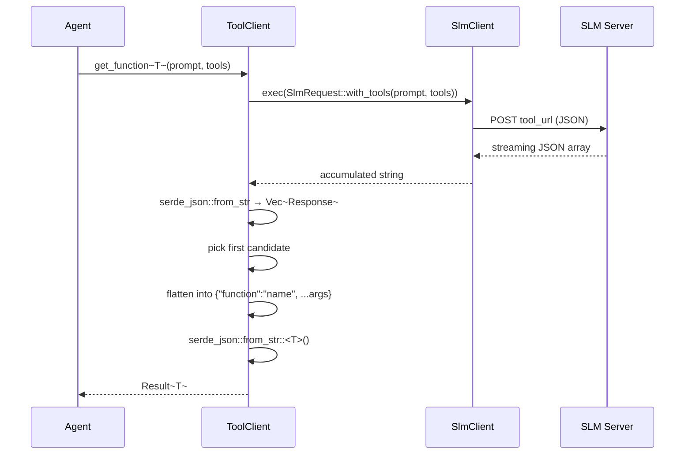

# LLM — Tool Client Module

The `llm::tool` module provides `ToolClient`, a higher-level client built on top of `SlmClient`. Its single responsibility is **function selection**: given a natural-language prompt and a named tool-set, it sends the request to the SLM, parses the returned function candidate, and deserialises it into a strongly-typed Rust struct ready for execution by an agent.

## Key Characteristics

| Property | Value |
|---|---|
| Transport | Delegates to `SlmClient` (HTTP POST) |
| Input | Prompt string + tool-set name |
| Output | Typed Rust struct (`T: DeserializeOwned`) |
| SLM response format | JSON array of ranked function candidates |
| Selection strategy | First element of the array (highest confidence) |

## Class Diagram



## Sequence Diagram



## SLM Response Format

The SLM returns a ranked array of function call candidates:

```json
[
  {
    "agent": "hera",
    "function": { "name": "read_temperature", "arguments": { "zone": "living room" } },
    "confidence": 0.999,
    "confidence_min": 0.981
  }
]
```

`ToolClient::exec` picks the first candidate and flattens it into a compact JSON object that the caller's generic `T` is expected to deserialise:

```json
{ "function": "read_temperature", "zone": "living room" }
```

The `function` field is used as a serde tag (`#[serde(tag = "function")]`) in the agent enumerations to dispatch to the right function struct.
