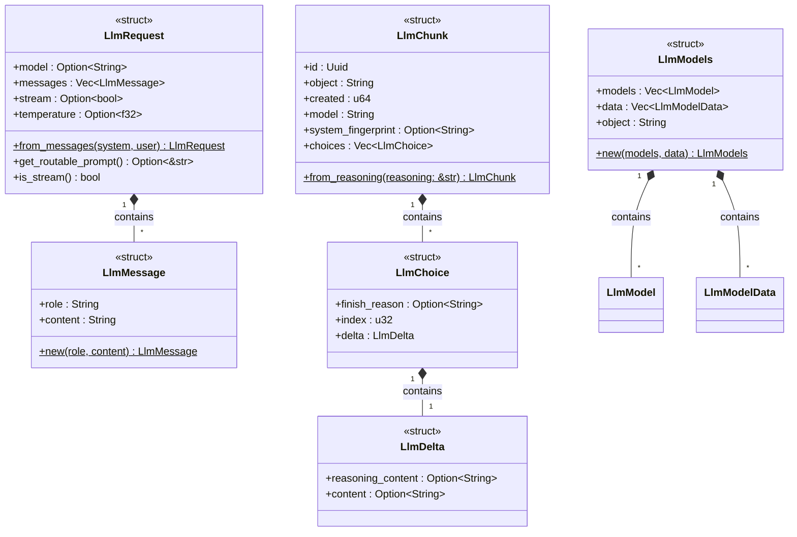

# LLM — Types Module

The `llm::types` module contains the data structures for the **OpenAI-compatible chat API** (`/v1/chat/completions` and `/v1/models`). These types are used both to accept incoming requests from API clients and to forward requests to the downstream local LLM.

## Request Types

### LlmRequest

Represents a chat completion request. Maps to the OpenAI `/v1/chat/completions` request body.

| Field | Type | Notes |
|---|---|---|
| `model` | `Option<String>` | Model name; forwarded as-is; may be `null` |
| `messages` | `Vec<LlmMessage>` | Conversation history |
| `stream` | `Option<bool>` | Whether to stream the response |
| `temperature` | `Option<f32>` | Sampling temperature; `0.0` for deterministic output |

`LlmRequest::from_messages(system, user)` is a convenience constructor that builds a two-message request (system + user) with `stream: true` and `temperature: 0.0`.

`get_routable_prompt()` returns the content of the last user message if it is under 200 characters — the condition under which the router is consulted for classification.

### LlmMessage

| Field | Type | Notes |
|---|---|---|
| `role` | `String` | `"system"`, `"user"`, or `"assistant"` |
| `content` | `String` | Message text |

## Response Types

### LlmChunk

Represents a single SSE chunk of a streaming chat completion response. Matches the OpenAI `chat.completion.chunk` object format.

| Field | Type | Notes |
|---|---|---|
| `id` | `Uuid` | Randomly generated per chunk |
| `object` | `String` | Always `"chat.completion.chunk"` |
| `created` | `u64` | Unix timestamp at creation |
| `model` | `String` | Hard-coded model name |
| `system_fingerprint` | `Option<String>` | Pass-through; may be `null` |
| `choices` | `Vec<LlmChoice>` | Always a single element |

`LlmChunk::from_reasoning(text)` constructs a chunk with the text in the `reasoning_content` field — used by `FactsStack` to stream internal reasoning steps back to the client.

### LlmDelta / LlmChoice

`LlmDelta` carries the incremental content of a chunk:

| Field | Notes |
|---|---|
| `reasoning_content` | Thinking / chain-of-thought text (skipped if `None`) |
| `content` | Normal response text (skipped if `None`) |

`LlmChoice` wraps `LlmDelta` with an `index` and `finish_reason`.

## Models Types

Used to respond to `GET /models`.

| Type | Description |
|---|---|
| `LlmModel` | `{ name, model }` — Ollama-style model entry |
| `LlmModelData` | `{ id, object: "model" }` — OpenAI-style model entry |
| `LlmModels` | `{ models: Vec<LlmModel>, data: Vec<LlmModelData>, object: "list" }` — combined response body |

## Class Diagram

