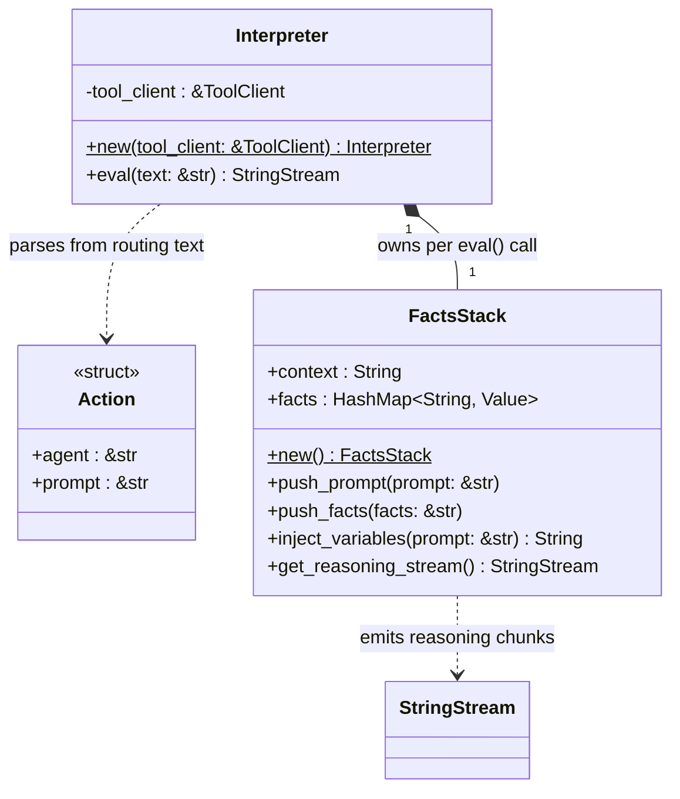
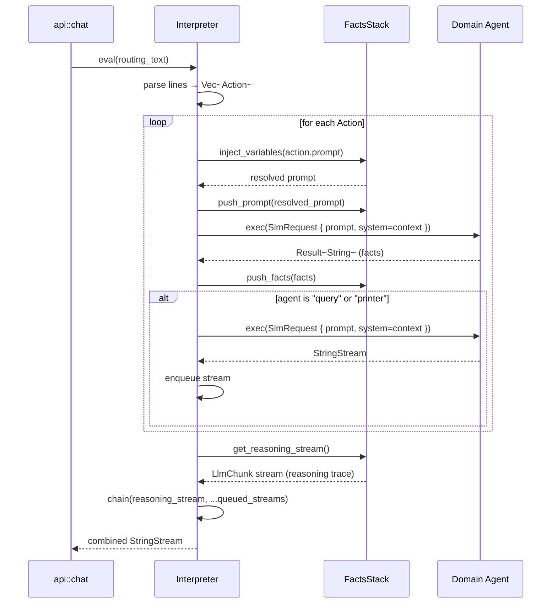

# Proc Module

The `proc` module is the **execution engine**. When the router classifies a prompt with high confidence, it returns a multi-line action plan. The `Interpreter` parses that plan and executes each action step by step, accumulating facts along the way. The final streamed response includes both the reasoning trace and any LLM-generated text.

## Key Characteristics

| Property | Value |
|---|---|
| Input | Multi-line routing text (`agent:prompt` pairs) |
| Execution | Sequential — each step can depend on the output of previous steps |
| Variable injection | `${key}` placeholders in prompts are replaced from the facts accumulator |
| Output | `StringStream` — reasoning chunks followed by any LLM text streams |

## Supported Agents

| Agent name | Handler |
|---|---|
| `time-service` | `TimeServiceAgent` |
| `user-profile` | `UserProfileAgent` |
| `measure-units` | `MeasurementUnitAgent` |
| `health` | `HealthAgent` |
| `weather` | `WeatherAgent` |
| `home-automation` | `HeraAgent` |
| `query` | `QueryAgent` (returns `StringStream`) |
| `printer` | `PrinterAgent` (returns `StringStream`) |

## Class Diagram



## Sequence Diagram

### eval() — Multi-Step Execution



## FactsStack

`FactsStack` maintains two parallel representations of accumulated knowledge:

- **`context`** (`String`): a human-readable prompt/answer log passed as the `system` message to subsequent agents.
- **`facts`** (`HashMap<String, Value>`): a key-value map built from single-entry JSON objects returned by agents, used for `${key}` variable substitution.

### Variable Injection

Prompts may contain `${key}` placeholders. Before an action is executed, `inject_variables` scans the prompt and substitutes any keys found in `facts`. Unresolved placeholders are left as-is.

Example:

```
Router plan:
  time-service: Get the date for today.
  health: Read the medical records for ${username} on ${date}.
```

After `time-service` pushes `{"date": "2026-05-30"}` to the facts stack, the second prompt becomes:

```
  health: Read the medical records for ${username} on 2026-05-30.
```

### Reasoning Stream

After all synchronous agents complete, `get_reasoning_stream()` serialises the accumulated `context` into a sequence of `LlmChunk` objects (with `reasoning_content` set) and emits them as the first part of the response stream. This lets the client observe the chain-of-thought before the final LLM-generated answer arrives.
