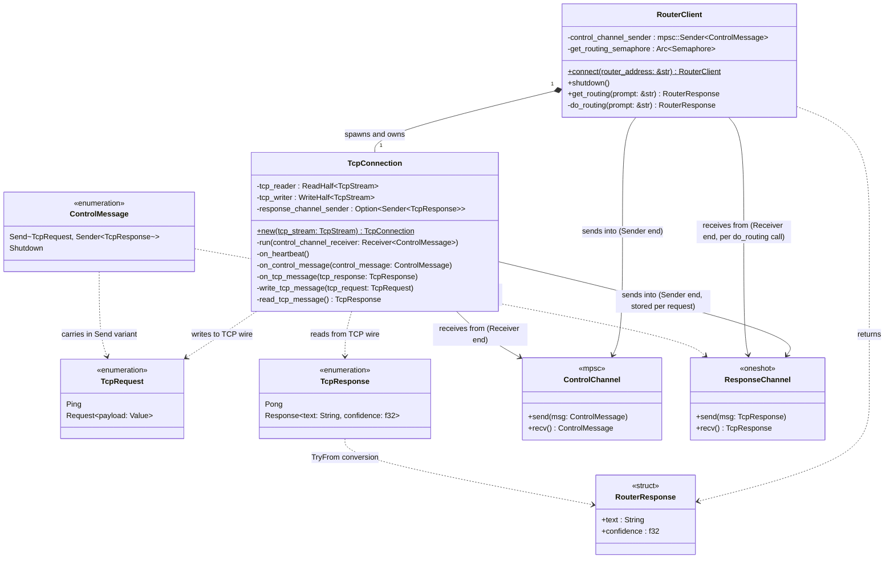
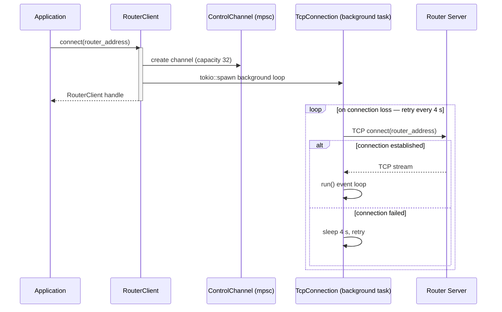
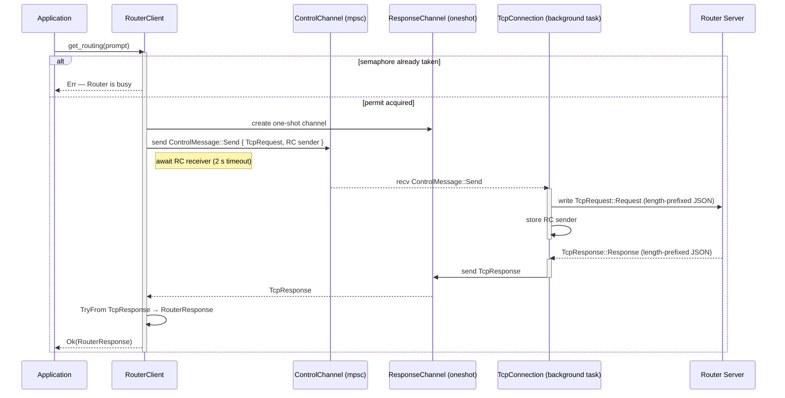
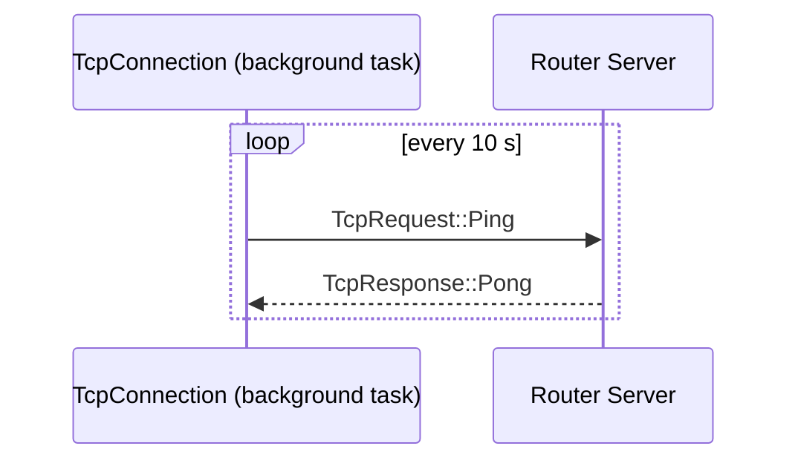
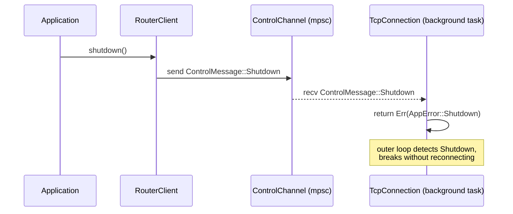

# Router Module

The router module provides a client for communicating with a remote LLM routing server over a persistent TCP connection. Given a user prompt, the routing server quickly classifies it and returns the name of the appropriate downstream service along with a confidence score — allowing the application to dispatch the request without invoking a full large language model.

## Key Characteristics

| Property | Value |
|---|---|
| Transport | TCP, length-prefixed JSON frames |
| Connection | Persistent, automatic reconnect on loss |
| Concurrency | Single request in flight at a time |
| Request timeout | 2 seconds (covers full round-trip) |
| Reconnect delay | 4 seconds |
| Expected latency | < 100 ms (miss), < 1 s (match) |

## Class Diagram



## Sequence Diagrams

### Connection Establishment

`connect()` is called once at startup. It creates the control channel, spawns the background connection manager, and returns immediately. The manager loop runs for the lifetime of the application, reconnecting automatically whenever the TCP connection is lost.



### Request Lifecycle

Each call to `get_routing()` must complete within 2 seconds. A semaphore ensures only one request is in flight at a time — concurrent callers receive an immediate error rather than silently queuing. The response channel is a one-shot: created per request, passed through the control channel inside the `Send` command, and consumed exactly once when the TCP response arrives.



### Heartbeat

While idle, `TcpConnection` sends a `Ping` to the server every 10 seconds to keep the connection alive and detect silent drops early.



### Shutdown



## Wire Protocol

Messages are exchanged as **length-prefixed JSON frames**:

```
┌─────────────────┬──────────────────────────────┐
│  4 bytes        │  N bytes                     │
│  u32 big-endian │  UTF-8 JSON payload          │
│  (length = N)   │                              │
└─────────────────┴──────────────────────────────┘
```

The JSON uses a `"type"` discriminant field (lowercase variant name):

```json
// client → server
{ "type": "ping" }
{ "type": "request", "payload": { "prompt": "what is the weather?" } }

// server → client
{ "type": "pong" }
{ "type": "response", "text": "weather", "confidence": 0.97 }
```

