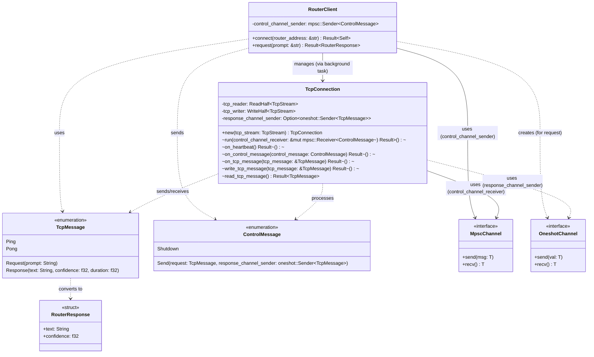
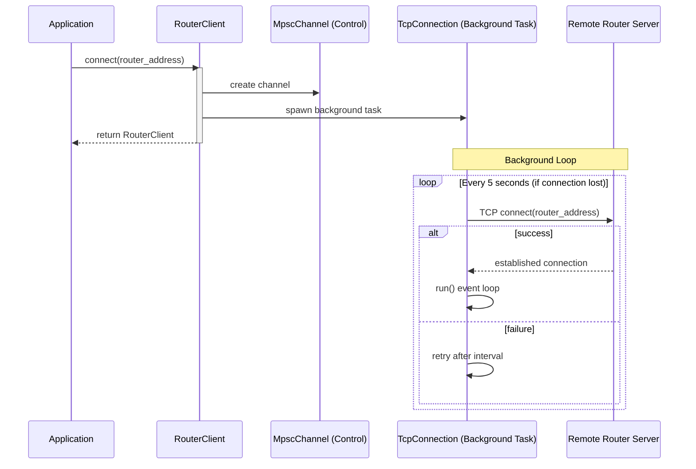
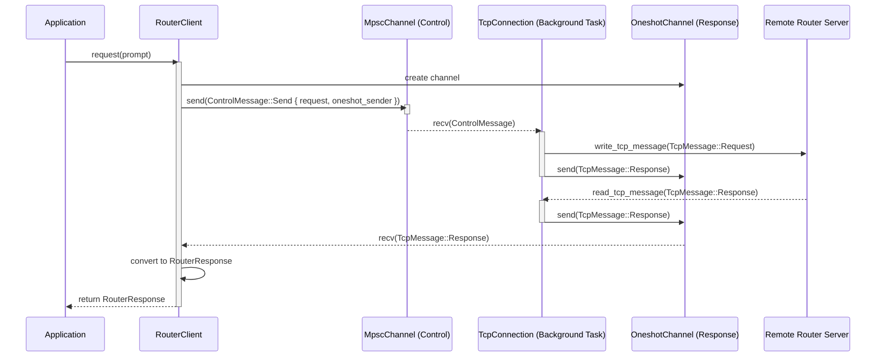

# Router Module

The router module provides a client implementation for communicating with a remote LLM routing server over TCP. It handles automatic reconnections and manages the request-response lifecycle through a background connection manager.

## Class Diagram

## Sequence Flow

### Connection Establishment
The `connect` method starts a background task that handles the connection loop and automatic retries.

### Request Lifecycle
The following sequence diagram illustrates the flow of a single request from the `RouterClient` to the remote server and back.

### Request Lifecycle:
1.  **Application** calls `request()` on the `RouterClient`.
2.  **`RouterClient`** creates a new `OneshotChannel` for the response.
3.  **`RouterClient`** wraps the request in a `ControlMessage::Send` and sends it via the `MpscChannel`.
4.  **`TcpConnection`** (running in a background task) receives the control message from the `MpscChannel`.
5.  **`TcpConnection`** serializes the `TcpMessage::Request` and writes it to the **Remote Router Server** via the TCP stream.
6.  **`TcpConnection`** stores the `OneshotChannel` sender.
7.  **Remote Router Server** processes the prompt and sends back a `TcpMessage::Response`.
8.  **`TcpConnection`** reads the response from the TCP stream.
9.  **`TcpConnection`** uses the stored `OneshotChannel` sender to pass the `TcpMessage` back to the `RouterClient`.
10. **`RouterClient`** receives the message, converts it into a `RouterResponse`, and returns it to the **Application**.
