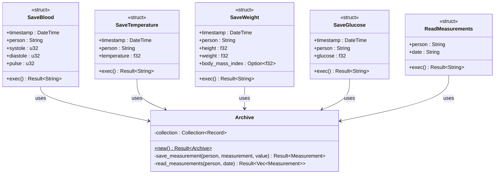
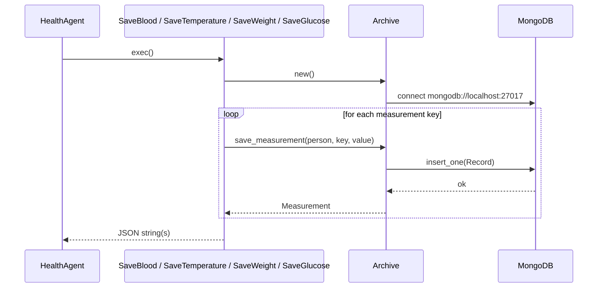
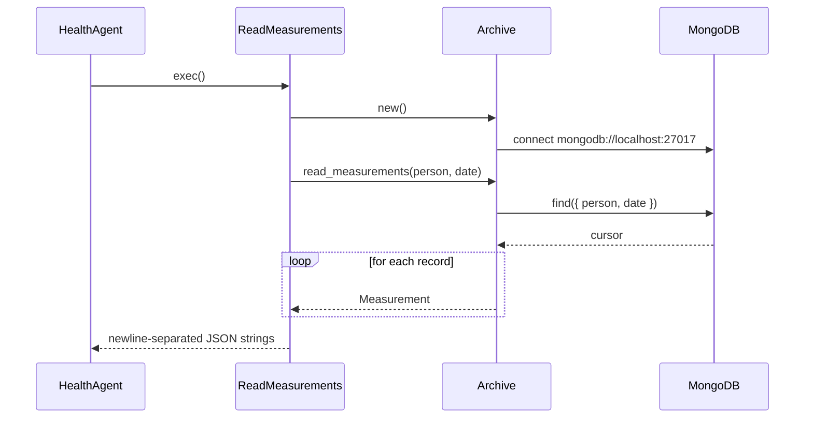

# Service — Health Module

The `service::health` module persists and retrieves personal health measurements in MongoDB. It is the data layer backing `HealthAgent`.

## Key Characteristics

| Property | Value |
|---|---|
| Database | MongoDB at `mongodb://localhost:27017` |
| Database name | `jarvis` |
| Collection | `health` |
| Record model | `{ timestamp, date, person, measurement, value, units }` |

## Supported Operations

| Struct | Description | Measurements written |
|---|---|---|
| `SaveBlood` | Saves a blood pressure reading | `systolic_pressure`, `diastolic_pressure`, `pulse_pressure`, `heart_rate` |
| `SaveTemperature` | Saves a body temperature reading | `body_temperature` |
| `SaveWeight` | Saves body weight; computes BMI automatically | `body_weight`, `body_mass_index` |
| `SaveGlucose` | Saves a blood glucose level | `glucose_level` |
| `ReadMeasurements` | Queries all measurements for a person on a given date | *(read only)* |

## Class Diagram

## Sequence Diagrams

### Save Measurement

### Read Measurements

## Measurement Units

| Measurement key | Unit |
|---|---|
| `systolic_pressure` | mmHg |
| `diastolic_pressure` | mmHg |
| `pulse_pressure` | mmHg |
| `heart_rate` | bpm |
| `glucose_level` | mg/dL |
| `body_temperature` | °C |
| `body_weight` | kg |
| `body_mass_index` | kg/m² |

## BMI Calculation

`SaveWeight` normalises the height to metres before computing BMI (in case the caller supplies it in centimetres) and stores both `body_weight` and `body_mass_index` in a single transaction.
