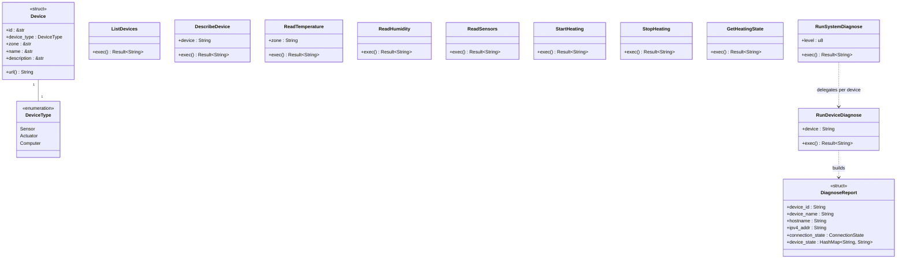
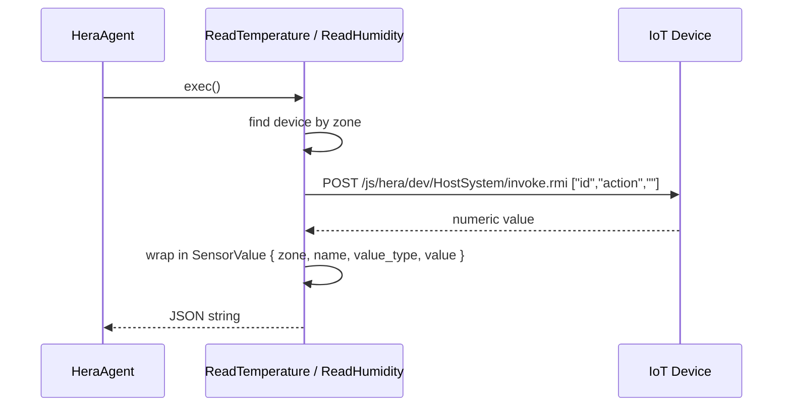
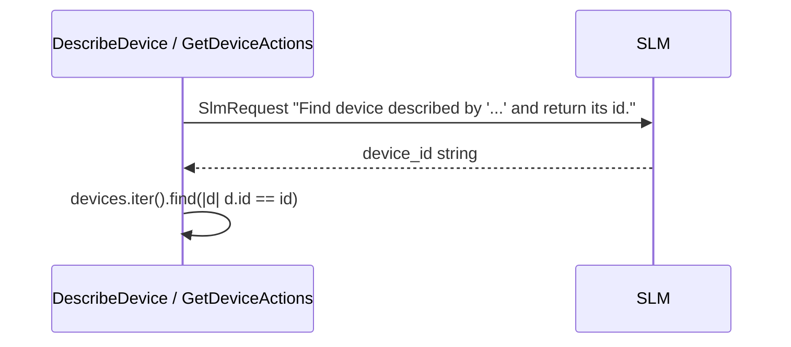
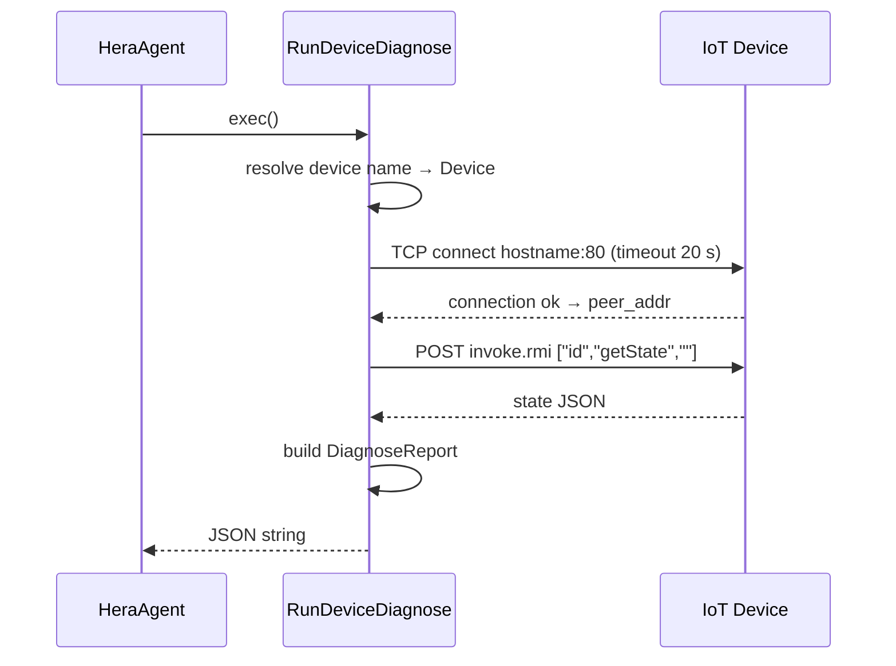

# Service — Hera Module

The `service::hera` module is the home automation data layer. It knows the registered IoT devices, can query their sensor readings, control the heating system, and run connectivity diagnostics. All device communication happens over HTTP using a proprietary RMI-style protocol.

## Key Characteristics

| Property | Value |
|---|---|
| Transport | HTTP POST to each device's `/js/hera/dev/HostSystem/invoke.rmi` |
| Device resolution | Fuzzy: an SLM call maps a natural-language device name to a device ID |
| Request format | JSON array: `["<device_id>", "<action>", "<argument>"]` |
| Response format | JSON object or plain value |

## Registered Devices

| ID | Type | Zone | Description |
|---|---|---|---|
| `dht-sensor` | Sensor | Kitchen | Temperature and humidity sensor |
| `thermostat` | Actuator | Kitchen | Controller for the central heating system |
| `thermostat-sensor` | Sensor | Living Room | Temperature sensor for the heating system |
| `hera` | Computer | Living Room | Mini PC running the home automation server |

## Supported Functions

| Struct | Description |
|---|---|
| `ListDevices` | Returns JSON descriptions of all registered devices |
| `DescribeDevice` | Returns device metadata and its supported action list |
| `GetDeviceActions` | Returns the documented actions for a specific device |
| `ReadTemperature` | Reads temperature from the sensor in a given zone |
| `ReadHumidity` | Reads humidity from the DHT sensor (Kitchen) |
| `ReadSensors` | Reads humidity + temperature from all sensors at once |
| `StartHeating` | Sets the thermostat setpoint to 30 °C (heating on) |
| `StopHeating` | Sets the thermostat setpoint to 10 °C (heating off) |
| `GetHeatingState` | Returns the current thermostat state |
| `RunDiagnose` | Dispatches to `RunDeviceDiagnose` or `RunSystemDiagnose` |
| `RunDeviceDiagnose` | Runs connectivity and state checks on a single device |
| `RunSystemDiagnose` | Runs `RunDeviceDiagnose` on every registered device |

## Class Diagram



## Sequence Diagrams

### Read Sensor Value



### Device Name Resolution

When a function receives a human-supplied device name (e.g. `"the kitchen sensor"`), `device()` uses the SLM to map it to a registered device ID:



### Device Diagnose



## Device RMI Protocol

```
POST http://<device_id>.local/js/hera/dev/HostSystem/invoke.rmi

Body: ["<device_id>", "<action>", "<argument>"]

Response: JSON value or object
```

Example:

```json
// request
["thermostat", "getState", ""]

// response
{"setpoint": 10.00, "hysteresis": 0.00, "temperature": 19.94, "running": false}
```
