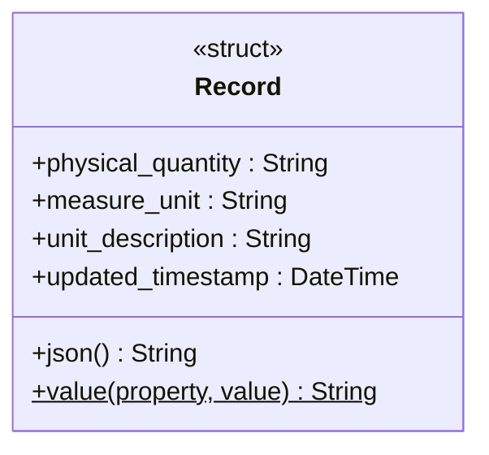
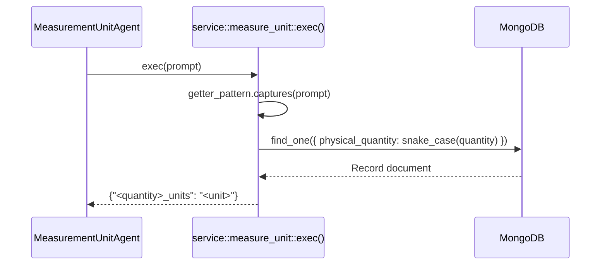

# Service — Measure Unit Module

The `service::measure_unit` module looks up the preferred measurement unit for a given physical quantity from MongoDB. It is the data layer backing `MeasurementUnitAgent`.

## Key Characteristics

| Property | Value |
|---|---|
| Database | MongoDB at `mongodb://localhost:27017` |
| Database name | `jarvis` |
| Collection | `measure_unit` |
| Record model | `{ physical_quantity, measure_unit, unit_description, updated_timestamp }` |
| Key format | `snake_case` (spaces and hyphens → underscores) |

## Supported Pattern

| Regex pattern | Example prompt | Result |
|---|---|---|
| `^get the measure units for (.+).$` | `"Get the measure units for distance."` | `{"distance_units": "km"}` |

## Class Diagram



## Dispatch Flow



## Return Format

The result is a single-key JSON object where the key is `<physical_quantity>_units`:

```json
{"distance_units": "km"}
{"body_weight_units": "kg"}
```

This format allows `FactsStack` to store the unit as a named fact and inject it into subsequent prompt templates using `${distance_units}`.
