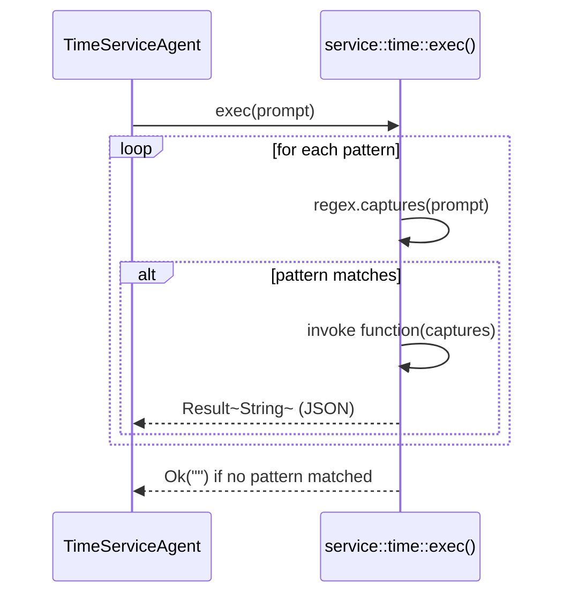

# Service — Time Module

The `service::time` module answers temporal questions using deterministic computation — no LLM or external service involved. It pattern-matches the prompt against a set of regular expressions and executes the corresponding date arithmetic.

## Key Characteristics

| Property | Value |
|---|---|
| Implementation | Regex dispatch (no external calls) |
| Clock source | `chrono::Local::now()` |
| Return format | Single-entry JSON `{"date": "YYYY-MM-DD"}` or computed value |

## Supported Patterns

| Pattern (case-insensitive) | Example prompt | Result |
|---|---|---|
| `date .*today` | `"Get the date for today."` | `{"date": "2026-05-30"}` |
| `date .*for yesterday` | `"Get the date for yesterday."` | `{"date": "2026-05-29"}` |
| `date .*day before yesterday` | `"Get the date for the day before yesterday."` | `{"date": "2026-05-28"}` |
| `^compute (.+) as the difference in (.+) between (\d{4}-\d{2}-\d{2}) and (\d{4}-\d{2}-\d{2}).$` | `"Compute (age) as the difference in (years) between (2026-04-14) and (1964-03-15)."` | `{"time duration in years": "62"}` |

## Date Difference Projections

The `date_difference` function supports the following time units:

| Projection | Computation |
|---|---|
| `years` | `end.year() - start.year()` |
| `months` | `(end - start).num_days() / 30` |
| `weeks` | `(end - start).num_weeks()` |
| `days` | `(end - start).num_days()` |
| `hours` | `(end - start).num_hours()` |
| `minutes` | `(end - start).num_minutes()` |
| `seconds` | `(end - start).num_seconds()` |

The start and end dates are automatically ordered, so the result is always non-negative.

## Dispatch Flow

