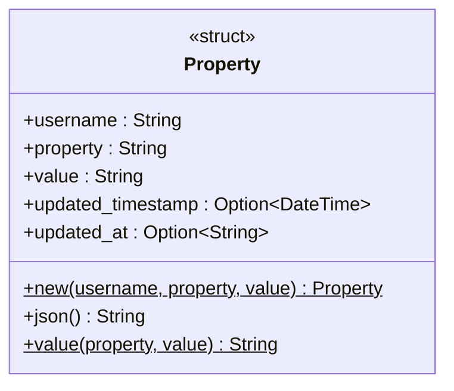
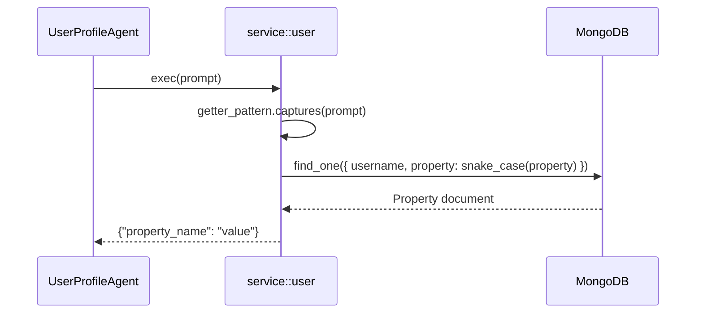
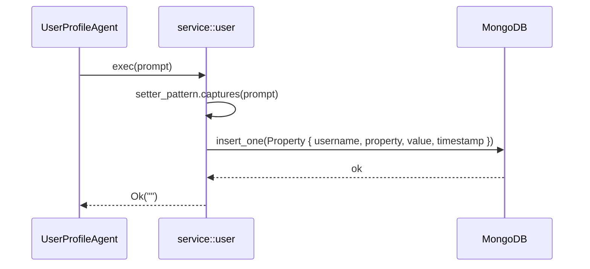

# Service — User Module

The `service::user` module manages user profile properties in MongoDB. It is the data layer backing `UserProfileAgent`, providing get, set, and update operations on arbitrary named properties associated with a username.

## Key Characteristics

| Property | Value |
|---|---|
| Database | MongoDB at `mongodb://localhost:27017` |
| Database name | `jarvis` |
| Collection | `user_profile` |
| Record model | `{ username, property, value, updated_timestamp }` |
| Property key format | `snake_case` (spaces and hyphens → underscores) |

## Supported Operations

| Regex pattern | Operation | Example prompt |
|---|---|---|
| `^set(?: the)? (.+) to (.+) (?:of\|for) (.+).$` | Insert a new property record | `"Set the social security number to 1640315227781 for Rotaru Iulian."` |
| `^get(?: the)? (.+) (?:of\|for) (.+).$` | Read latest property value | `"Get the social security number for Rotaru Iulian."` |
| `^update(?: the)? (.+) to (.+) (?:of\|for) (.+).$` | Update existing property value | `"Update the email to user@example.com for Rotaru Iulian."` |

## Class Diagram

## Sequence Diagram

### Get Property

### Set Property

## Notes

- `get_property` is also exposed as a public `async fn` for direct use by `UserProfileAgent` (the `"Get my username."` shortcut bypasses regex matching entirely and returns a hard-coded value).
- Property names are normalised to `snake_case` before storage and lookup so that `"social security number"` and `"social_security_number"` resolve to the same key.
- `set_property` always inserts a new record (append-only); `update_property` uses `$set` to update an existing document in-place.
