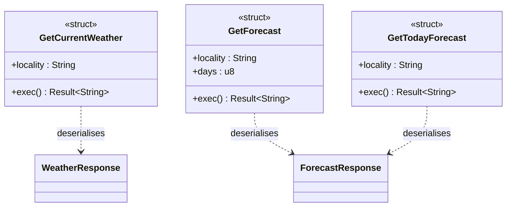
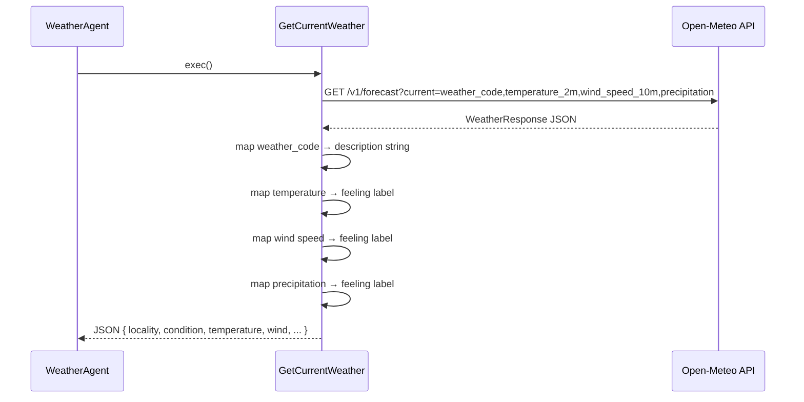
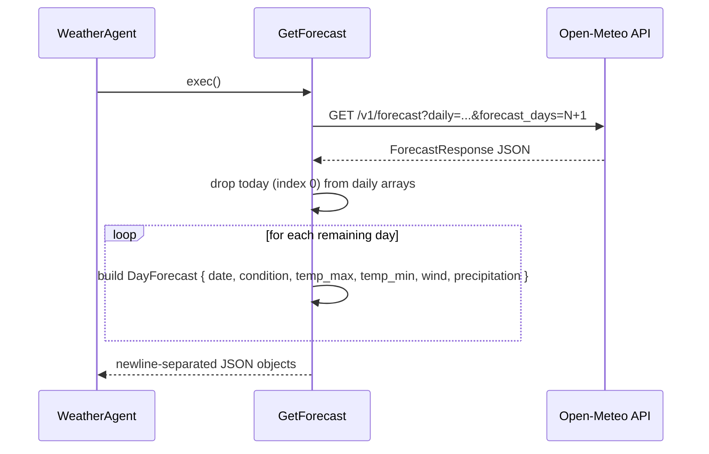
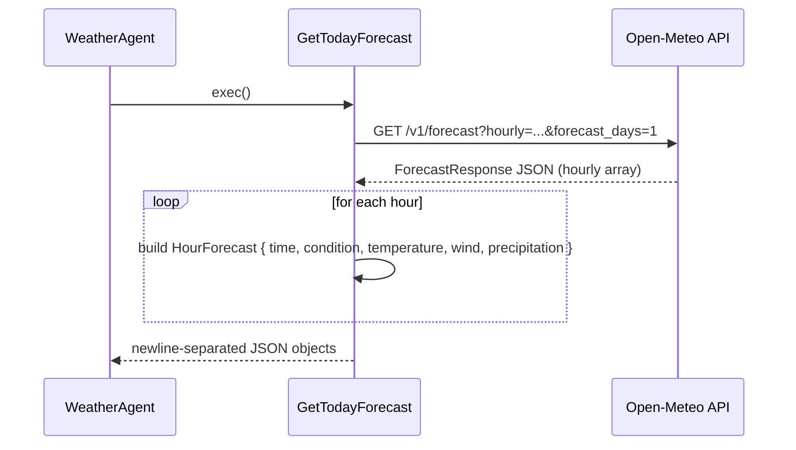

# Service — Weather Module

The `service::weather` module fetches weather data from the **Open-Meteo** public API and returns it as structured JSON. It is the data layer backing `WeatherAgent`. Coordinates are currently hard-coded for Iași, Romania (47.18°N, 27.49°E).

## Key Characteristics

| Property | Value |
|---|---|
| External API | `https://api.open-meteo.com/v1/forecast` |
| Temperature unit | Celsius |
| Wind speed unit | km/h |
| Precipitation unit | mm |
| Timezone | Auto (resolved by the API from coordinates) |

## Supported Functions

| Struct | Description |
|---|---|
| `GetCurrentWeather` | Current conditions: temperature, wind, precipitation chance |
| `GetForecast` | Daily forecast for `days` days ahead |
| `GetTodayForecast` | Hourly forecast for today |

## Class Diagram

## Sequence Diagrams

### GetCurrentWeather

### GetForecast

### GetTodayForecast

## Weather Code Mapping

Open-Meteo returns numeric WMO weather codes. The module maps these to human-readable strings at deserialisation time using a custom serde deserialiser.

| Code range | Example description |
|---|---|
| 0 | `"clear sky"` |
| 1–3 | `"mainly clear"`, `"partly cloudy"`, `"overcast"` |
| 45–48 | `"fog"`, `"depositing rime fog"` |
| 51–57 | drizzle variants |
| 61–67 | rain variants |
| 71–77 | snow variants |
| 80–86 | showers / snow showers |
| 95–99 | thunderstorm variants |

## Qualitative Labels

Numeric values are enriched with qualitative feeling labels:

- **Temperature** (°C): `"bitterly freezing"` → … → `"dangerously scorching"` (15 levels)
- **Wind speed** (km/h): `"calm"` → … → `"hurricane"` (13 Beaufort-style levels)
- **Precipitation probability** (%): `"no precipitation expected"` → … → `"definite"` (11 levels)
