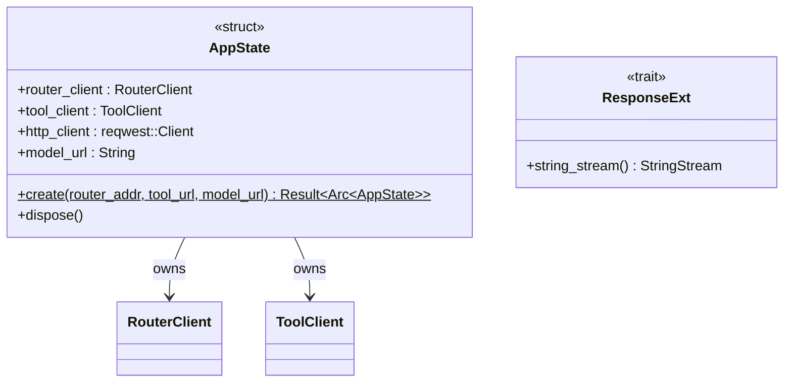

# Types Module

The `types` module defines the shared application state and the async stream type aliases used across modules. It is the central place for cross-cutting type definitions.

## AppState

`AppState` is the shared, `Arc`-wrapped context injected into every HTTP request handler via Axum's `State` extractor.

| Field | Type | Description |
|---|---|---|
| `router_client` | `RouterClient` | Client for the LLM router (prompt classification) |
| `tool_client` | `ToolClient` | Client for the tool-calling SLM |
| `http_client` | `reqwest::Client` | Shared HTTP client for outbound LLM requests |
| `model_url` | `String` | URL of the downstream LLM `/v1/chat/completions` endpoint |

`AppState::create()` connects both LLM clients and wraps the result in `Arc<AppState>`.  
`AppState::dispose()` sends the shutdown signal to the router background task.

## Stream Type Aliases

All stream aliases are `Pin<Box<dyn Stream<...> + Send>>`.

| Alias | Item type | Used for |
|---|---|---|
| `StringStream` | `Result<String>` | SSE text chunks from SLM or LLM responses |
| `ByteStream` | `Result<Bytes>` | Raw byte chunks proxied from the downstream LLM |
| `EventStream` | `Result<Event>` | Axum SSE events wrapping `StringStream` items |

## ResponseExt

A convenience trait implemented on `reqwest::Response`. Its single method `string_stream()` converts a byte-streaming HTTP response into a `StringStream`, stripping the `data:` prefix that SSE-emitting upstream models include in each chunk.

## Result Alias

```rust
pub(crate) type Result<T> = std::result::Result<T, AppError>;
```

## Class Diagram


